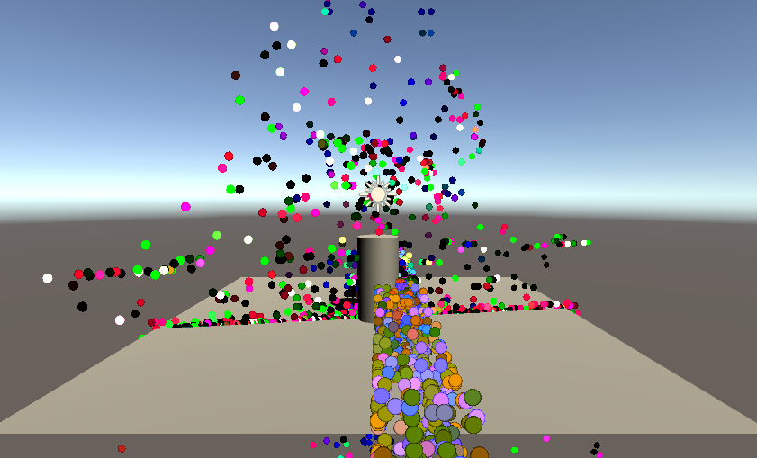

# GPUでパーティクル処理

リポジトリには、衝突判定やカリングの機能はありません

# 自分なりに変更した点
-カリングと衝突判定の実装。
-四方にのみパーティクルが出るようになりました。
-

# 進め方

- 本リポジトリをフォークしてください
- フォークしたリポジトリをcloneします
- Unityのプロジェクトを更新して実装してください。
- このテキストファイルに変更点を記載してください
- result.pngを自分の結果を保存して差し替えてください
- プルリクエストを出して提出してください
